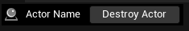
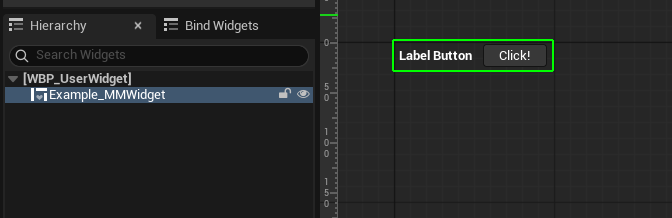
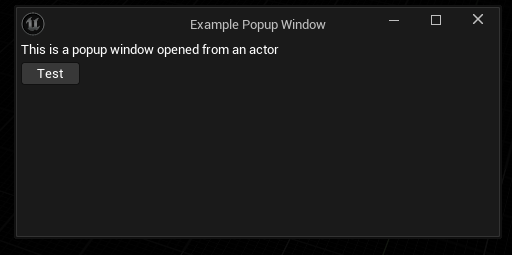
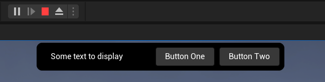
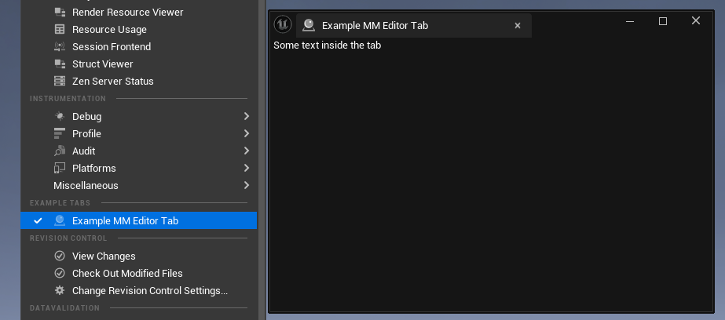
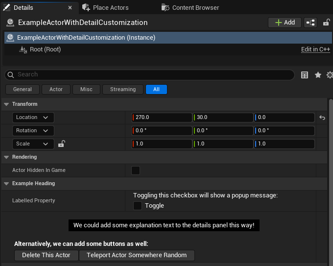
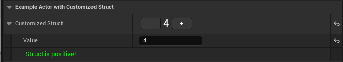

# EmmsUI Plugin for UnrealEngine-Angelscript
EmmsUI is a plugin for drawing immediate mode UI in Unreal, built for the [UnrealEngine-Angelscript](https://angelscript.hazelight.se/) fork.
It works by maintaining a tree of [UMG](https://dev.epicgames.com/documentation/en-us/unreal-engine/creating-user-interfaces-with-umg-and-slate-in-unreal-engine) widgets that is controlled through angelscript code.
Because UnrealEngine-Angelscript provides runtime hotreloading of script files, this makes it very easy to develop editor and tool UI.

EmmsUI functions live in the `mm::` namespace to be easy to type, hence the name.

As an example, the angelscript code:

```cpp
mm::WithinBorder(FLinearColor::Black);
mm::BeginHorizontalBox();

	mm::VAlign_Center();
	mm::Image(n"ClassIcon.Actor");

	mm::VAlign_Center();
	mm::Padding(10, 0);
	mm::Text(f"{Actor.ActorNameOrLabel}");

	if (mm::Button("Destroy Actor"))
		Actor.DestroyActor();

mm::EndHorizontalBox();
```

Results in the UI:



## Why based on UMG?
Many existing plugins for immediate mode UI exist for unreal. Often based around Dear ImGui, and with Epic themselves working on a Slate-based immediate UI plugin (SlateIM).

From experience with different methods, wrapping UMG had the most advantages:

- We often wanted a hybrid approach between immediate UI and widget blueprints, with parts of the UI written in both.

- UMG already specifies reflection for all the available properties. Using this reflection means the entirety of UMG is available in EmmsUI, without having to manually re-specify everything that's possible to do in Slate.

- Sometimes you want to do something advanced that doesn't lend itself well to immediate mode UI. EmmsUI allows retrieving the underlying UMG objects, so it's always possible to do advanced things directly.

## Wrapper-Based API Approach
EmmsUI takes a slightly different approach to standard immediate UI:
- The most common widgets have helper functions, this is your standard `mm::Text()` or `mm::Button()`
- However, individual widgets can still be named to variables to access all their properties

For example, `mm::Text()` creates a `UTextBlock` widget, which is wrapped in a `mm<UTextBlock>` to manage the immediate mode state.

The function `mm::Text()` has optional parameters for text color and font size and the like, eg:
```cpp
mm::Text("Large Blue Text", FontSize=20, Color=FLinearColor::Blue);
```

Only the common properties of `UTextBlock` are available this way.
To add a shadow to the text, for example, you can set this on the wrapped widget afterward:

```cpp
mm<UTextBlock> LargeText = mm::Text("Large Blue Text", FontSize=20, Color=FLinearColor::Blue);
LargeText.SetShadowColorAndOpacity(FLinearColor::Red);
```

The `mm::Text()` helper is itself just a function that calls the generic `mm::Widget()` call that can be used to wrap any UMG widget type.
Without the helper function, the same text widget can be written as:

```cpp
mm<UTextBlock> LargeText = mm::Widget(UTextBlock);
LargeText.SetText(FText::FromString("Large Blue Text"));
LargeText.SetFontSize(20);
LargeText.SetColorAndOpacity(FLinearColor::Blue);
LargeText.SetShadowColorAndOpacity(FLinearColor::Red);
```

The mm<> wrapper template manages all of the immediate mode state changes.
If you delete one of the property set function calls, it will recognize this and reset the property on the UMG widget back to the default.

## Editable State
Helper functions are available for managing editable state, similar to other immediate mode UI libraries.

Some examples:

```cpp
// Create an editable text box that the user can edit
// UserText will be modified to whatever the user entered
FString UserText;
mm::EditableTextBox(UserText);

// Create a checkbox that the user can click
// bCheckedValue will be modified to whether the user checked the box or not
bool bCheckedValue = false;
mm::CheckBox(bCheckedValue, "Check Box Label");

// Create a spinbox that the user can modify the value of
// NumericVale will be set to whatever the user specified
float NumericValue = 0.0;
mm::SpinBox(NumericValue);
```

## Panel Widgets
Panel widgets are UMG widgets that can contain other widgets.
There are two main ways of placing immediate widgets within panels:

### Begin()/End() Panel 
The function `mm::Begin()` creates an immediate panel widget, and sets it as active.
Subsequent immediate widgets are added into the active panel, until `mm::End()` is called to deactivate it.

Panel widgets operate as a stack, so you can nest Begin and End calls and it will behave appropriately.

For all C++ panel widgets types, individual helper functions are also bound.
For example, `mm::BeginHorizontalBox()` is equivalent to `mm::Begin(UHorizontalBox)`.

This lets you write code like this:
```cpp
// A vertical box containing a row with three buttons, and two rows with one button
mm::BeginVerticalBox();
	mm::BeginHorizontalBox(); // First row of the vertical box: a nested horizontal box
		mm::Button("1A"); // Placed within the horizontal box
		mm::Button("1B"); // Placed within the horizontal box
		mm::Button("1C"); // Placed within the horizontal box
	mm::EndHorizontalBox();

	mm::Button("2"); // Second row of the vertical box

	mm::Button("3"); // Third row of the vertical box
mm::EndVerticalBox();
```

### Within() Panel
Many UMG panel widgets only support having one child widget inside them.
To make these easier to use, the `mm::Within()` syntax will create a panel widget which is active for exactly one child.
The immediate widget created right after the call to `Within` will be placed inside the panel, widgets after that will not be.

Just as with `mm::Begin()`, helper functions are available, so `mm::WithinBorder()` is equivalent to `mm::Within(UBorder)`.

```cpp
mm::WithinBorder(FLinearColor::Red); // Create a UBorder with a red background color, and place the next widget inside
mm::WithinSizeBox(Width=200, Height=200); // Create a USizeBox inside the Border, and place the next widget inside
mm::Button("Button Inside Border"); // The button is placed inside the SizeBox

mm::Text("Text Outside Border"); // This text is _not_ placed inside either the border or the sizebox
```

### Slot Properties
Many panel widgets have slots with properties such as padding, alignment, etc
To specify slot properties for a widget, call into them right before adding the widget into the panel

For example, to add a button that is centered horizontally within a vertical box, call `mm::HAlign_Center()` right before adding the button:

```cpp
mm::BeginVerticalBox();
	mm::HAlign_Center(); // Center the button within the vertical box row
	mm::Button("Centered Button");
mm::EndVerticalBox();
```

#### Example: Horizontal Boxes
Some examples of slot properties within a horizontal box:

```cpp
mm::BeginHorizontalBox();
	mm::Slot_Fill(); // Expand this row to fill as much of the horizontal box as possible
	mm::VAlign_Fill(); // Fill the entire vertical height of the horizontal box
	mm::Padding(10, 2, 2, 2); // Pad by 10px on the left, 2px in the other directions
	mm::Button("BIG BUTTON");
mm::EndHorizontalBox();
```

#### Example: Canvas Panels
Some examples of slot properties within a canvas panel:

```cpp
mm::BeginCanvasPanel();
	mm::Anchors(0.5, 0.5); // Anchor the next widget to the middle of the canvas
	mm::AutoSize(true); // The next widget is auto-sized within the canvas slot
	mm::Offsets(0, 0, 100, 30); // Set the offsets on the canvas panel slot
	mm::Text("Centered Text");
mm::EndCanvasPanel();
```

### Re-entering an Existing Panel
More widgets can be added to an existing panel by storing it in a variable and then calling `mm::Begin()` on it again later.
For example, you can create two vertical boxes next to each other and then add values to them one by one:

```cpp
mm::BeginHorizontalBox();
	// The created widget is returned from Begin()
	mm<UVerticalBox> LeftBox = mm::BeginVerticalBox();
	mm::EndVerticalBox();

	// Alternatively, you can also explicitly create it without Begin-ing it:
	mm<UVerticalBox> RightBox = mm::Widget(UVerticalBox);
mm::EndHorizontalBox();

// Add the numbers 1 through 10 to both of the columns
for (int i = 1; i <= 10; ++i)
{
	// Add it to the left box
	mm::Begin(LeftBox);
		mm::Text(f"{i}");
	mm::End();

	// Add it to the right box
	mm::Begin(RightBox);
		mm::Text(f"{i}");
	mm::End();
}
```


## Responding to Events
All event handlers on the UMG widgets are automatically exposed through the wrappers.
To check whether an event has occurred, call one of the `Was...()` functions on the mm widget.

For example, to check whether the text in an editable text box has changed, you can call `WasTextChanged()` on it.

```cpp
FString CurrentText;
mm<UEditableTextBox> TextInput = mm::EditableTextBox(CurrentText);
if (TextInput.WasTextChanged())
{
	Print(f"The user changed the text to {CurrentText}!");
}
```

### Events with Parameters
Some UMG event handlers will have parameters that you may want to check, beyond just whether the event occurred or not.

For example, the commit handler on the editable text box has the committed text and the commit method.
These can be retrieved by passing variables into `WasTextCommitted()`, which will then be set to the event's parameters:

```cpp
FText CommittedText;
ETextCommit CommitMethod;
if (TextInput.WasTextCommitted(CommittedText, CommitMethod))
{
	if (CommitMethod == ETextCommit::OnEnter)
	{
		Print(f"User committed the text {CommittedText} by pressing Enter");
	}
}
```

### Binding an Event
The `Was...()` event functions only check whether the event has happened the previous frame.
In cases where you want to detect multiple events, or if you want to respond immediately when it happens, it is possible to bind functions to events as well.

These use the same events but with an `On...()` prefix, and take an object and a function to bind:

```cpp
mm<UCheckBox> CheckBox = mm::Widget(UCheckBox);
CheckBox.OnCheckStateChanged(this, n"CheckboxChanged");

...

UFUNCTION()
void CheckboxChanged(bool bIsChecked)
{
}
```

## Drawing UI
Immediate UI must always be drawn while within a context that supports it.
The draw context determines where the widgets will show up in the UI.

There are a number of ways to enter a draw context and add immediate widgets:

### UMMWidget
The `UMMWidget` class is a `UUserWidget` on which you can override the `DrawWidget()` method to add immediate widgets.
Widget classes of this type can then be used in any widget blueprint as normal:

```cpp
class UExample_MMWidget : UMMWidget
{
	UFUNCTION(BlueprintOverride)
	void DrawWidget(float DeltaTime)
	{
		mm::BeginHorizontalBox();

			mm::VAlign_Center();
			mm::Text("Label Button", bBold=true);

			mm::Spacer(10, 0);

			mm::Button("Click!");

		mm::EndHorizontalBox();
	}
}
```



#### Drawing to an MMWidget Externally
Rather than creating a class inheriting from `UMMWidget`, it is also possible to draw to an existing `UMMWidget` from outside it.
To do so, call `mm::BeginDraw()` with the `UMMWidget`, and then `mm::EndDraw()` when done drawing.

For example, an actor drawing to the MMWidget displayed by its Widget Component could look like this:

```cpp
class AExample_WidgetComponent : AActor
{
	UPROPERTY(DefaultComponent)
	UWidgetComponent WidgetComponent;
	default WidgetComponent.WidgetClass = UMMWidget;

	UFUNCTION(BlueprintOverride)
	void Tick(float DeltaSeconds)
	{
		UMMWidget DisplayedWidget = Cast<UMMWidget>(WidgetComponent.GetWidget());
		mm::BeginDraw(DisplayedWidget);
			mm::Text("Text drawn to a Widget Component", Color=FLinearColor::Black);
		mm::EndDraw();
	}
}
```

Note that any particular UMMWidget can only be drawn to _once_ per frame.
If you draw more than once, the widgets from the second draw will replace the ones from the first draw.

### UMMPopupWindow
The `UMMPopupWindow` class is an easy way to open popup window UI.
Implement the `DrawWindow()` method in a class inheriting `UMMPopupWindow`, and then call `mm::SpawnPopupWindow()` to open it.

For example, to open it via a `CallInEditor` button on an actor's details panel:

```cpp
/**
 * An example actor that opens an UMMPopupWindow when a CallInEditor button is clicked
 */
class AExample_ActorWithPopupWindowButton : AActor
{
	UFUNCTION(CallInEditor)
	void OpenImmediateWindow()
	{
		mm::SpawnPopupWindow(UExample_ActorMMPopupWindow);
	}
}

class UExample_ActorMMPopupWindow : UMMPopupWindow
{
	default WindowTitle = "Example Popup Window";
	default DefaultWindowSize = FVector2D(500, 200);

	UFUNCTION(BlueprintOverride)
	void DrawWindow(float DeltaTime)
	{
		mm::Text("This is a popup window opened from an actor");
		if (mm::Button("Test"))
			CloseWindow();
	}
}
```



### BeginDrawViewportOverlay
The function `mm::BeginDrawViewportOverlay()` can add an immediate mode overlay to the viewport.
This works both inside PIE, and in the editor viewport if called from a subsystem or the like.

As an example, this is a subsystem that draws a black box with some buttons in it to the editor viewport:

```cpp
class UExample_SubsystemWithOverlay : UScriptEngineSubsystem
{
	UFUNCTION(BlueprintOverride)
	void Tick(float DeltaTime)
	{
		// Start drawing an overlay on top of the viewport in immediate mode
		mm::BeginDrawViewportOverlay(n"ExampleOverlay");
			
			// Draw a centered black box with rounded corners at the top of the viewport
			mm::HAlign_Center();
			mm::Padding(4);
			mm::WithinBorder(FLinearColor::Black, 10);

			// Within the black box, add a horizontal box with some buttons
			mm::Padding(4);
			mm::WithinSizeBox(MinHeight=40);
			mm::BeginHorizontalBox();

			// Text displayed in the horizontal box
			{
				mm::VAlign_Center();
				mm::Padding(20, 4);
				mm::Text("Some text to display");
			}

			// Some space between the text and the buttons
			{
				mm::Spacer(30, 0);
			}

			// The first button which logs a message when clicked
			{
				mm::Padding(4);
				if (mm::Button("Button One"))
				{
					Log("Button one clicked!");
				}
			}

			// The second button which logs a message when clicked
			{
				mm::Padding(4);
				if (mm::Button("Button Two"))
				{
					Log("Button two clicked!");
				}
			}

			mm::EndHorizontalBox();
		mm::EndDraw();
	}
}
```




### UMMEditorUtilityTab
Any classes that inherit from `UMMEditorUtilityTab` will be openable from the unreal Tools menu as dockable editor tabs.
Override the `DrawTab()` function within the class to draw immediate widgets to it.

An example tab could look like this:

```cpp
class UExample_EditorUtilityTab : UMMEditorUtilityTab
{
	default TabTitle = "Example MM Editor Tab";
	default Category = "Example Tabs";
	default Icon = n"ClassIcon.Actor";

	UFUNCTION(BlueprintOverride)
	void DrawTab(float DeltaTime)
	{
		mm::Text("Some text inside the tab");
	}
}
```




### UMMClassDetailCustomization
Details panel customizations can be created by implementing a class that inherits from `UMMClassDetailCustomization`.

This detail customization can then add new property rows that immediate UI can be drawn to.

See [Example_ClassDetailCustomization.as](Script-Examples/Example_ClassDetailCustomization.as) for an example implementation:




### UMMScriptStructDetailCustomization
By implementing a class inheriting from `UMMScriptStructDetailCustomization`, a detail customization can be made for any struct using immediate UI.

See [Example_StructDetailCustomization.as](Script-Examples/Example_StructDetailCustomization.as) for an example implementation:



## Common Widget Examples
### UTextBlock

```cpp
mm<UTextBlock> mm::Text(FString Text, float FontSize, FLinearColor Color, bool bWrap, bool bBold)
```

Places a `UTextBlock` widget with the configured settings.
Unspecified settings leave a reasonable default, so you can add text with just:

```cpp
mm::Text("Some Text");
```

### UImage
The `mm::Image()` function creates a `UImage` widget.
There are several versions of this function that can take a texture, a material, or a slate brush, either by style name or brush struct.

For example:

```cpp
mm::Image(n"GenericCommands.Paste"); // Show a UImage of the standard editor "Paste" icon

UTexture2D Texture;
mm::Image(Texture, 16, 16); // Show a texture, with image size set to 16x16

mm::Image(Texture, 100, 50, FLinearColor::Red); // Show a texture with image size set to 100x50, and the image color set to red
```

### UBorder
The standard way to use a border is to use `mm::WithinBorder()` to add a UBorder.
The next widget to be drawn after `WithinBorder()` will be added as the child of the border.

Several versions of `WithinBorder()` exist that change how the border's background is rendered:

```cpp
// Add a text inside a border with a green background color
mm::WithinBorder(FLinearColor::Green);
mm::Text("Red text in a green box!", Color=FLinearColor::Red);

// Add a green-tinted success icon within a border using the Checkerboard slate brush style
mm::HAlign_Center();
mm::WithinBorder(n"Checkerboard");
mm::Image(n"Icons.Success", ColorAndOpacity = FLinearColor::Green);

// Add a half-filled progress bar widget within a gray border with rounded corners
// The rounded corners have a 10px radius, and a 2px black outline
mm::WithinBorder(FLinearColor::Gray, 10, FLinearColor::Black, 2);
mm::Padding(10); // 10px padding between the edge of the UBorder and the UProgressBar we're going to add
mm<UProgressBar> ProgressBar = mm::Widget(UProgressBar);
ProgressBar.SetPercent(0.5);
```

### USizeBox
Sizeboxes can be added with `mm::WithinSizeBox()`.
This takes several optional parameters to control the size of the widget within it, with the following signature:

```cpp
mm<USizeBox> WithinSizeBox(float32 Width = 0, float32 Height = 0, float32 MinWidth = 0, float32 MaxWidth = 0, float32 MinHeight = 0, float32 MaxHeight = 0)
```

Some examples of how it can be used:

```cpp
// Add a long text inside a size box with a width override of 200px
// The long text is set to line wrap
mm::HAlign_Left();
mm::WithinSizeBox(Width=200);
mm::Text("Lorem ipsum dolor sit amet, consectetur adipiscing elit, sed do eiusmod tempor incididunt ut labore et dolore magna aliqua.", bWrap=true);

// Draw a button with a minimum size of 100px by 40px, but allow it to be larger if needed
mm::WithinSizeBox(MinWidth=100, MinHeight=40);
mm::Button("Button With Potentially Long Label");
```

### UButton
The `mm::Button()` function creates a standard button with a text label on it.
Optionally, a style brush can also be passed with an icon to put in front of the label.

```cpp
// Button with a text label
mm::Button("Labelled Button");

// Button with a text label and an icon based on an editor style brush
mm::Button("Label with Icon", n"GenericCommands.Delete");
```

The `mm<UButton>` type can be used implicitly in an if statement to check whether the button was pressed.
This lets you write:

```cpp
if (mm::Button("Click Me"))
{
	Print("Button was clicked!");
}
```

This is functionally equivalent to calling the `WasClicked()` method, which can be done explicitly like this as well:

```cpp
mm<UButton> ClickButton = mm::Button("Click Me");
if (ClickButton.WasClicked())
{
	Print("Button was clicked!");
}
```

If you want to display custom content within the button, this is of course possible as well.
Buttons are panel widgets, so they can be used with `mm::Begin()` like any other:

```cpp
// A button with a label aligned on the right edge of the button,
// and with the icon displayed _after_ the text
mm<UButton> CustomButton = mm::BeginButton();
	mm::HAlign_Right();
	mm::BeginHorizontalBox();
		mm::Text("Label In Front of Icon");
		mm::Spacer(10);
		mm::Image(n"GenericCommands.Cut");
	mm::EndHorizontalBox();
mm::EndButton();

if (CustomButton.WasClicked())
{
	Print("Customized button was clicked!");
}
```

### UEditableTextBox
Add an editable text box with `mm::EditableTextBox()`, which takes a reference to a string and assigns the value the user has typed to it:

```cpp
FString Value;
mm::EditableTextBox(Value);

Log(f"Current text box value is: {Value}");
```

### UCheckBox
For checkboxes, use `mm::CheckBox()`, which takes a reference to a boolean and assigns whether the user has checked the checkbox to it:

```cpp
// A single checkbox that assigns a boolean
bool bBoxIsChecked = false;
mm::CheckBox(bBoxIsChecked);

// A checkbox with a label text
mm::CheckBox(bBoxIsChecked, "CheckBox Label Text");
```

### USpinBox
Use `mm::SpinBox()` to show a numerical input box.
It takes a reference to a float and assigns it to the value in the input box.
It's also possible to pass a minimum and maximum value.

```cpp
// Show a single numeric value
float NumericValue = 0.0;
mm::SpinBox(NumericValue);

// Show a numeric value, constrained between min and max
float ConstrainedValue = 0.0;
mm::SpinBox(ConstrainedValue, MinValue=0, MaxValue=100);
```

#### Example: Integer SpinBox
Because EmmsUI is immediate mode UI, it is easy to create reusable widgets by implementing them as functions.
For example, you can create your own helper function to add a SpinBox that only takes integer values:

```cpp
mm<USpinBox> IntegerSpinBox(int& IntegerValue)
{
	float FloatValue = IntegerValue;

	mm<USpinBox> SpinBox = mm::SpinBox(FloatValue);
	SpinBox.SetDelta(1);
	SpinBox.SetMinFractionalDigits(0);
	SpinBox.SetMaxFractionalDigits(0);

	IntegerValue = Math::FloorToInt(FloatValue);
	return SpinBox;
}
```

### UComboBox
The `mm::ComboBox()` set of helper functions creates dropdown combo boxes.
You can pass in both the set of options, and a reference to a variable that will be assigned to the current selected option:

```cpp
// Show a ComboBox to choose between a list of options
TArray<FString> ComboOptions;
ComboOptions.Add("First Option");
ComboOptions.Add("Second Option");

FString CurrentValue;
mm::ComboBox(ComboOptions, CurrentValue);

Log(f"Current selected value is {CurrentValue}");
```

It is also possible to directly pass in a reference to any Enum value.
The ComboBox will then display all of the enum values as options automatically, and assign the enum value to what is selected:

```cpp
// Show a ComboBox automatically filled with all elements of an Enum
enum EMyOptions
{
	FirstEnumOption,
	SecondEnumOption,
}

...

EMyOptions CurrentValue = EMyOptions::FirstEnumOption;
mm::ComboBox(CurrentValue);

if (CurrentValue == EMyOptions::SecondEnumOption)
{
	mm::Text("Second enum option is selected!");
}

```

### USpacer
Spacers are an empty widget that leaves blank space in the layout of a particular size.
You can create them with `mm::Spacer()` in two ways:

```cpp
mm::Spacer(10); // This is a square 10x10 spacer, width and height are the same

mm::Spacer(32, 8); // This is a 32x8 spacer where the width and height are different
```

### UListView
There are several ways to use list views in immediate mode.
The most natural way is to pass in an array of item data objects:

```cpp
TArray<UObject> ItemObjects;
ItemObjects.Add(ObjectOne);
ItemObjects.Add(ObjectTwo);

mm<UListView> ListView = mm::ListView(ItemObjects);
```

After creating the list view, looping over it will give you all the entry widgets that are currently visible to the user.
You can then draw immediate widgets to those entry widgets, letting you make a listview in immediate mode without any extra fuss:

```cpp
for (UMMListViewEntryWidget EntryWidget : ListView)
{
	UObject ItemObject = EntryWidget.GetListItem(UObject);
	mm::BeginDraw(EntryWidget);
		mm::Text(f"{ItemObject.Name}");
	mm::EndDraw();
}
```

Instead of passing in a list of item objects, you can also pass in an _amount_ of items, and retrieve the item index from the entry widget instead:

```cpp
int ItemCount = 10;
mm<UListView> ListView = mm::ListView(ItemCount);

for (UMMListViewEntryWidget EntryWidget : ListView)
{
	int VisibleItemIndex = EntryWidget.GetItemIndex();
	mm::BeginDraw(EntryWidget);
		mm::Text(f"Item {VisibleItemIndex}");
	mm::EndDraw();
}
```

If you'd rather separate the item drawing into a class, you can also inherit from `UMMListViewEntryWidget`, and pass that class `mm::ListView`.

```cpp
mm::ListView(ItemObjects, UMyListEntryWidget);

...

class UMyListEntryWidget : UMMListViewEntryWidget
{
	UFUNCTION(BlueprintOverride)
	void DrawWidget(float DeltaTime)
	{
		UObject Item = GetListItem(UObject);
		mm::Text(f"{Item.Name}");
	}
}
```

Of course, you can pass any UUserWidget class as the item widget class, so if you want to specify a widget blueprint instead of anything immediate, you can do so as well:

```cpp
TSubclassOf<UUserWidget> ItemWidgetClass;
mm::ListView(ItemObjects, ItemWidgetClass);
```

### UDetailsView
A `UDetailsView` is an editor widget that displays the properties of an object and lets the user edit them.
These are very convenient for allowing editing operations in your tools.

You can call `SetObject()` on a `mm<UDetailsView>` to specify which object to edit:

```cpp
UObject ObjectToEdit = ...;

mm<UDetailsView> DetailsView = mm::Widget(UDetailsView);
DetailsView.SetAllowFiltering(true);
DetailsView.SetObject(ObjectToEdit);
```

There is also a `SetStruct()` helper available that can take a reference to any struct value.
All the properties of the struct will be displayed, and the referenced struct will be set to the values edited in the UI:

```cpp
struct FEditableStruct
{
	UPROPERTY()
	int NumericValue = 2;
	UPROPERTY()
	FString StringValue;
}

...

FEditableStruct Struct;

// Show the properties of FEditableStruct in an editable details view
mm<UDetailsView> DetailsView = mm::Widget(UDetailsView);
DetailsView.SetStruct(Struct);

// All properties of Struct will now be assigned to the values from the UI
mm::Text(f"User has entered {Struct.NumericValue} as a number");
```

### Paintable Widget
A `UMMPaintableWidget` is a helper widget for drawing arbitrary boxes and lines.
After creating one using `mm::Paint()`, you can add draws to it that will be rendered to that widget's area.

All positions and sizes passed into the draw functions are relative to the geometry occupied by the paintable widget:

```cpp
mm<UMMPaintableWidget> Paint = mm::Paint();
// Draw two red lines
Paint.DrawLine(FVector2D(0, 0), FVector2D(10, 10), FLinearColor::Red, 2.0);
Paint.DrawLine(FVector2D(10, 10), FVector2D(20, 8), FLinearColor::Red, 2.0);

// Draw a solid-colored box
Paint.DrawBox(FVector2D(50, 8), FVector2D(16, 16), FLinearColor::Black);
// Draw a box using an editor style brush
Paint.DrawBox(FVector2D(100, 8), FVector2D(32, 32), n"GenericCommands.Copy");

// Draw text on the paintable widget
Paint.DrawText("Painted text", FVector2D(200, 8));
```

## Accessing the Underlying UMG Objects
For certain advanced cases, you might need to retrieve the actual UMG widgets behind the immediate mode UI.
To do this, call `GetUnderlyingWidget()` on the `mm<>` wrapper.

For example:

```cpp
// Create an immediate button inside the mm<UButton> wrapper
mm<UButton> Button = mm::Button("Button Label");

// Retrieve the actual UMG UButton:
UButton UnderlyingButton = Button.GetUnderlyingWidget();
```

Two things are important to keep in mind when retrieving underlying widgets:
- The underlying widget may be recreated at any point, if there are changes to the immediate hierarchy, so any modifications you make to it are not guaranteed to persist across frames.
- The underlying widgets are reused between frames whenever possible, so any modifications you make to it may persist to subsequent frames unintentionally.